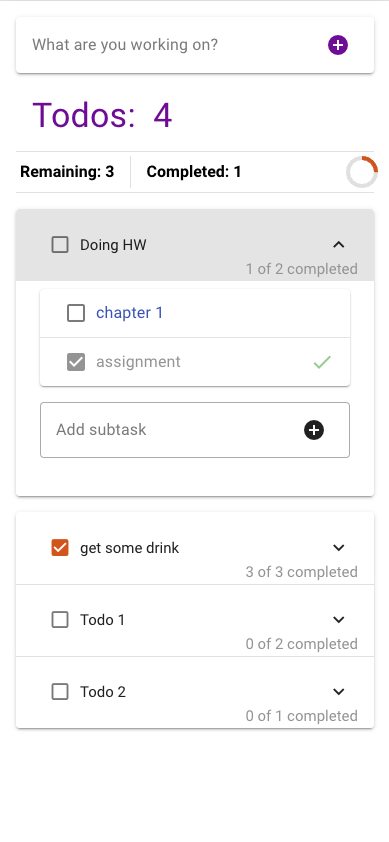
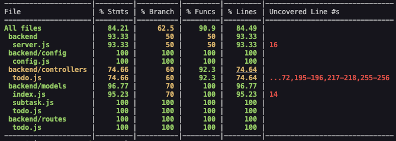
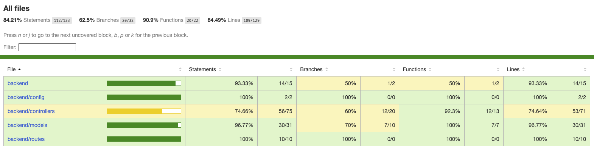

# Full Stack Javascript (Todo App)

## Table of Contents
- [Overview](#overview)
- [Directory Structure](#directory-structure)
- [Tech Stack](#tech-stack)
- [Getting Started](#getting-started)
  - [Database Setup](#database-setup)
  - [Server Setup](#server-setup)
  - [API Documentation](#api-documentation)
  - [Frontend Setup](#frontend-setup)
- [Usage](#usage)
- [Screenshots](#screenshots)
- [Testing](#testing)
  - [Backend Testing](#backend-testing)
  - [Frontend Testing](#frontend-testing)
- [Acknowledgments](#acknowledgments)
- [Contact Information](#contact-information)

## Overview
This project is a Todo application built with full-stack JavaScript technologies. The application allows users to manage their tasks, create a list of todos, update their statuses, and manage subtasks related to each todo.

## Directory Structure
The project is organized into two main directories: backend and frontend. Additionally, there's an attached Postman collection file provided for easy API endpoint testing. Each directory contains its own `.git` file for version control, and you can review each project's history using `git log`.

## Tech Stack
This project makes use of the following technologies:

- [Node.js v18.12.1](https://nodejs.org/)
- Frontend: [Vue3](https://v3.vuejs.org/)
- Server: [Express.js](https://expressjs.com/)
- Database: [Postgres 14](https://www.postgresql.org/)
- ORM: [Sequelize](https://sequelize.org/)
- Testing framework: [Jest](https://jestjs.io/)

## Getting Started

### Database Setup
1. Install [PostgreSQL](https://www.postgresql.org/download/) on your local machine.
2. Create a new database named 'todo_app_dev' (you can choose another name if you prefer).
3. Create a new user with the appropriate permissions to access the database.

### Server
1. Navigate to the backend directory with `cd backend`.
2. Install the necessary dependencies using `npm install`.
3. Edit the '.env' file to setup the database connection (refer to the '.env.example' file for an example).
4. Run `npx sequelize-cli db:migrate` to execute database migrations.
5. Seed the database with test data by running `npm run seed`.
6. Start the server with `npm start`. The backend server will now be running on http://localhost:4000.
7. (Optional) Test API endpoints by importing the attached 'api_endpoints.postman_collection.json' into [Postman](https://www.postman.com/).

### API Documentation
You can use the attached Postman collection to explore and test the API endpoints:
- GET /todos: Retrieves a list of todos along with their respective attributes and related subtasks.
- POST /todos: Creates a new todo with the specified title.
- PATCH /todos/:id: Updates the status of the identified todo.
- POST /todos/:id/subtasks: Adds a new subtask and assigns it to the identified todo.
- PATCH /subtasks/:id: Updates the status of the identified subtask.
- GET /todos/:id/subtasks: Retrieves a list of a todo's subtasks as identified by the id.

### Frontend Setup
1. Navigate to the frontend directory with `cd frontend`.
2. Install dependencies using `yarn install`.
3. Edit the '.env' file to setup the server connection (refer to the '.env.example' file for guidance).
4. Run `yarn dev` to start the server in development mode. The frontend server will now be running on http://localhost:3000.

## Usage
Here's how you can use the application:
1. Create a new todo at the top of the screen.
2. The checkbox reflects the status of the todo.
3. View a collapsible list of all related subtasks.
4. Add a new subtask at the bottom of the list.
5. Each Todo and Subtask can have its status switched between "complete" and "pending". Completing a Todo will mark all nested Subtasks as completed. Conversely, setting a Subtask under a completed Todo to "pending" will re-open the parent Todo.

## Screenshots

**Todo App screenshot**

## Testing

### Backend Testing
1. Navigate to the backend directory with `cd backend`.
2. Make sure you have a datanbase name 'todo_app_test' and have record at least one in table 'Todos' and 'Subtasks' also. (you can duplicate from 'todo_app_dev' database)
3. Execute the tests and generate a coverage report by running `npm run test:coverage`.

The coverage report will look something like this:

**Terminal Coverage Report**

**HTML Coverage Report** in directory 'backend/coverage/lcov-report/index.html'

### Frontend Testing
1. Navigate to the frontend directory with `cd frontend`.
2. Change 'baseURL' variable in '/src/services/apiService.js' to testing environment
3. Execute the tests and generate a coverage report by running `yarn test:unit`.

The coverage report will resemble the backend coverage report.

## Acknowledgments
Special thanks to the following resources:

- [Vue3 Documentation](https://v3.vuejs.org/)
- [Express.js Documentation](https://expressjs.com/)
- [Postgres Documentation](https://www.postgresql.org/docs/14/index.html)
- [Sequelize Documentation](https://sequelize.org/master/manual/getting-started.html)
- [Jest Documentation](https://jestjs.io/docs/getting-started)

## Contact Information
For any questions, suggestions, or discussions, please feel free to reach out.
Email: weerapat.buachuen@gmail.com
